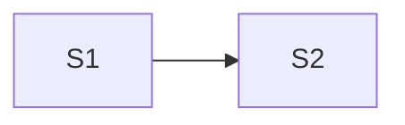

# Create Implementation Task

Create one task file at `docs/agent-tasks/<short-purpose>.md` from an explicitly selected completed design document. The design owns intended behavior; the task owns execution order, scope, validation, and progress. Modify documentation only.

## 1. Verify the design and current system

Read repository instructions and the selected design document completely. Inspect the working tree, relevant source, tests, callers, conventions, and existing tasks so the plan reflects the current codebase.

Stop and report exact design gaps instead of inventing decisions when implementation would require an unspecified or contradictory API, behavior, lifecycle, error, migration, compatibility, security, performance, or testing contract.

This step is complete when the design is implementation-ready and every current integration point and material implementation constraint is known.

## 2. Derive vertical slices

Define the smallest independently verifiable vertical slices around user-visible or domain-observable outcomes. Each slice must leave the codebase coherent. Use an enabling slice only when no meaningful end-to-end outcome can be implemented first.

For every design obligation, assign at least one owning slice. Record this in a design-coverage table; the table must account for every behavior, API surface, invariant, compatibility obligation, and test tier that requires implementation. A design section may map to several slices, but no requirement may be silently unassigned.

Each slice defines:

- one observable outcome;
- exact design references;
- the smallest coherent scope and relevant integration points;
- implementation notes that apply settled design and repository conventions;
- agent-executable validation and what each check proves;
- dependencies on other slices.

Validation must not require human interaction, manual server operation, unavailable credentials, or inaccessible infrastructure. Where direct verification is impossible, specify the strongest automated or static substitute and its limitation.

This step is complete when every design obligation is covered, every dependency is explicit, and every slice can be completed and verified independently once its dependencies are satisfied.

## 3. Approve the execution shape

Present together:

1. the task goal and boundary;
2. the ordered slices and their outcomes;
3. the complete design-coverage mapping;
4. a Mermaid roadmap when dependencies have parallel routes or are otherwise non-obvious.

Ask the user to confirm the proposed task. If revised, present the complete updated proposal and obtain approval again. Do not write the task file before explicit approval.

This step is complete when the user approves the complete slice and dependency structure.

## 4. Write the task

````markdown
# Implementation Task: <change>

## Status
Ready for implementation.

## Design authority
- `<path-to-design>`

## Goal
<what this task delivers and its implementation boundary>

## Progress
- [ ] Slice 1 — <outcome>

## Current codebase state
<only facts that materially affect execution>

## Design coverage
| Design requirement | Owning slice |
| --- | --- |
| `<design section or invariant>` | Slice 1 |

## Execution roadmap


## Slices

### Slice 1 — <outcome>
**Status:** Pending

**Design references**
- `<design path>#<section>`

**Outcome**
<what becomes observably true>

**Scope**
- <smallest coherent implementation and integration points>

**Implementation notes**
- <settled implementation guidance without restating the design>

**Validation**
- `<command or agent-executable check>` — <what it proves and any limitation>

**Dependencies**
- None.

## Final verification
<checks that genuinely require all slices>
````

Omit the Mermaid section when a graph adds no information. Refer to the design instead of copying its contracts into the task. Add slice-specific exclusions only when they prevent tempting adjacent work.

After writing, recheck that the coverage table is exhaustive, references resolve, dependencies match the roadmap, and every validation is executable. Summarize the task path, slices, routes, and any stated validation limitations, then stop.
